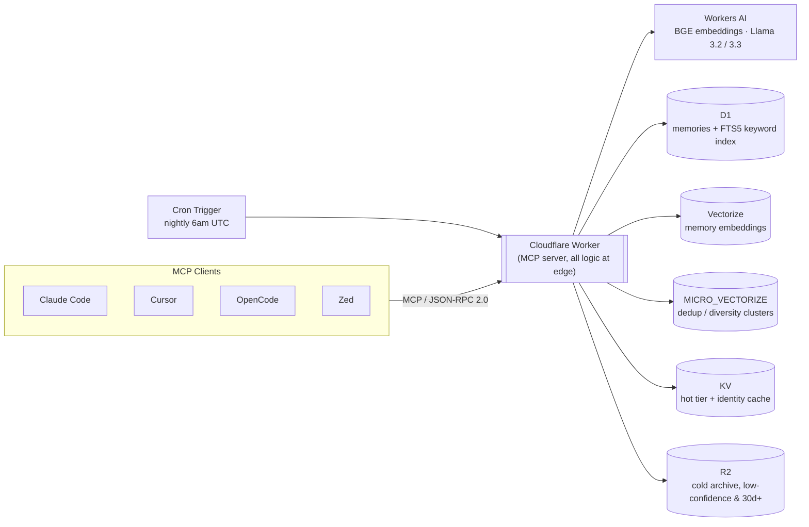

# Gaussian Memory

[](https://github.com/LohitJaga/gaussian-memory-worker/actions/workflows/deploy.yml)
[](LICENSE)

Persistent memory for AI coding assistants. Works across sessions, devices, and projects without any manual setup once installed.

Built on Cloudflare Workers. You deploy it to your own account, own your data, and pay Cloudflare directly (~$0/month on the free tier for most users).

**Benchmarked against a naive-cosine baseline on a frozen, ID-matched gold set** (41 real queries against a real, lived-in memory store — see [BENCHMARKING.md](BENCHMARKING.md) for methodology): **87% recall** on direct/multi-hop queries and **83%** on vague, loosely-worded ones, vs **67%** and **58%** for plain top-K cosine search at the same `top_k`. That gain isn't free — Gaussian Memory spends 3.6–7.5x more tokens per query to get there, since it injects more context per retrieval, not just ranks better. Full frontier (recall and token cost across `top_k` 4/8/16/24) is in BENCHMARKING.md; this is the honest number, not the flattering one.

## What it does

The system automatically captures what you worked on, what decisions you made, and what's still open. A hook fires on every prompt you send, not just the first one of a session, and injects relevant context back in before the model answers. It runs three queries in parallel (your actual prompt, recent decisions for the current project, and your working conventions/preferences), merges and score-filters the results, and caps what gets injected so it stays a small top-up instead of a wall of text.

The difference from other memory systems is that every memory carries its own confidence score, and that score moves over time. Reinforce a belief and its confidence climbs. Leave it untouched for weeks and it fades.

What actually shows up in context, injected automatically:

```
[0.94] (auth-service ↑/decision) ● Replaced Redis with D1 for session storage — zero egress fees, edge-native
[0.81] (auth-service →/procedural) ● JWT migration still incomplete — old sessions not yet cut over
```

`[0.94]` is that memory's relevance to your current prompt, ranked by the retrieval pipeline described below. `(auth-service ↑/decision)` is the project, a confidence trend arrow (`↑` rising, `→` stable, `↓` fading), and the memory type (`decision`, `episodic`, `semantic`, `procedural`, `session`).

### Why not just RAG?

RAG retrieves chunks from a static document store, and a chunk means whatever it meant when you indexed it, forever. This system tracks confidence: facts you keep confirming get sharper, facts you haven't touched in months fade out, and a new fact that contradicts an old one gets flagged and resolved instead of handed back as two equally-weighted chunks for you to sort out. RAG over your codebase or docs solves a different problem. This is memory of what you decided and why.

## Features

- Persistent memory across sessions, devices, and editors, all backed by the same D1/Vectorize store
- Confidence scoring per memory: sharpens with reinforcement, decays when ignored, gets discarded once it fades too far
- Hybrid retrieval — cosine similarity, BM25 keyword search, recency, and access frequency, fused and confidence-weighted
- Automatic capture of decisions, code diffs, and session summaries without asking
- Contradiction detection: a new fact that conflicts with an old one gets flagged and resolved instead of silently duplicated
- Entity graph and spreading activation surface related memories even when the wording doesn't match
- One MCP server for Claude Code, Cursor, OpenCode, and Zed — same tools, same behavior everywhere
- Self-hosted on your own Cloudflare account, no managed service, ~$0/month on the free tier

## Quick start

**Requirements:** Node.js 18+, a [Cloudflare account](https://dash.cloudflare.com/sign-up) (free tier works).

```bash
npm install -g wrangler
wrangler login

git clone https://github.com/LohitJaga/gaussian-memory-worker
cd gaussian-memory-worker
npm install
npx gaussian-memory init
```

Reload your shell (`source ~/.zshrc` or open a new terminal), restart your harness, and it's live.

<details>
<summary>What <code>init</code> actually does</summary>

- Creates D1 database, Vectorize index, and KV namespace in your Cloudflare account
- Patches `wrangler.toml` with your resource IDs
- Runs D1 schema migrations
- Deploys the worker
- Generates and sets an `AUTH_TOKEN` secret
- Writes `~/.gaussian-memory-env` with your worker URL and token (chmod 600), and auto-appends `source ~/.gaussian-memory-env` to your `~/.zshrc` or `~/.bashrc`
- Writes the auth token to `~/.claude/mcp.json`
- Auto-installs and configures hooks for Claude Code, OpenCode, Cursor, and Zed if it detects them on your machine (prompts before installing anything)

On Windows without WSL, add `GAUSSIAN_WORKER_URL` and `GAUSSIAN_AUTH_TOKEN` as System Environment Variables instead.

</details>

## Cloudflare plan

Workers AI has a 10,000 neuron/day limit on the free plan. Two sessions/day with the nightly cron runs around 2,000–2,500 neurons, so normal use won't hit the limit. The one thing that can is a full domain rebuild (`memory_rebuild_domains` with `targeted=false`, covered under [MCP tools](#mcp-tools) below); it's resumable and doesn't need to run often.

## Seed your memory (recommended)

New users can start with context rather than building it from scratch over weeks:

```bash
npx gaussian-memory ingest my-context.md
```

Point it at any markdown file — your existing CLAUDE.md, README, notes, or a purpose-built context file. The parser handles real-world formatting: YAML frontmatter, nested bullets, ordered lists, checkboxes, code blocks (skipped), and plain paragraphs under headers.

Example format (but most markdown works):

```markdown
## About me
- Software engineer, 3 years Python and TypeScript
- Currently building a SaaS app, focusing on the auth layer

## Working preferences
- Concise responses, no unnecessary explanation
- Show file:line references when pointing to code

## Current projects
- Rewriting auth middleware, moving from JWT to session tokens
- Exploring Cloudflare Workers for lower latency

## Key decisions
- Chose PostgreSQL over MongoDB for relational data model
- Using Tailwind for styling, no component library
```

Each bullet or paragraph is stored as a memory. The section header is prepended as context.

## Hook setup

### Claude Code

<details>
<summary>Configured automatically by <code>init</code> — expand for manual setup</summary>

Copy the hook scripts and add them to `~/.claude/settings.json`:
```bash
cp hooks/gaussian-*.sh ~/.claude/hooks/
chmod +x ~/.claude/hooks/gaussian-*.sh
```

```json
{
  "hooks": {
    "UserPromptSubmit": [{ "hooks": [{ "type": "command", "command": "bash ~/.claude/hooks/gaussian-retrieve.sh", "statusMessage": "Recalling memories..." }] }],
    "PostToolUse":      [{ "hooks": [{ "type": "command", "command": "bash ~/.claude/hooks/gaussian-posttool.sh", "timeout": 15, "async": true }] }],
    "Stop":             [{ "hooks": [{ "type": "command", "command": "bash ~/.claude/hooks/gaussian-store.sh", "timeout": 30, "async": true }] }]
  }
}
```

> **Windows:** Use WSL. Run `npx gaussian-memory init` inside the WSL shell and add env vars to your WSL shell profile.

</details>

### OpenCode

<details>
<summary>Configured automatically by <code>init</code> if <code>~/opencode.json</code> is detected — expand for manual setup and what you get</summary>

Manual setup: add to `~/opencode.json`:

```json
{
  "plugin": ["~/.opencode/gaussian-memory.mjs"],
  "mcp": {
    "gaussian-memory": {
      "type": "remote",
      "url": "https://your-worker.workers.dev",
      "headers": {
        "Authorization": "Bearer your-token"
      }
    }
  }
}
```

Then copy the plugin file:
```bash
cp hooks/opencode-gaussian-memory.mjs ~/.opencode/gaussian-memory.mjs
```

**What you get:**
- **MCP tools** — all 26 memory tools available natively in the model's tool list. The model calls `memory_retrieve`, `memory_store`, etc. without any prompting.
- **Auto-store** — every user and assistant message >80 chars is stored automatically via plugin hooks (`chat.input`, `chat.message`).
- **Session-end extraction** — `session.idle` and `session.compacted` hooks trigger `memory_extract_and_store` on the full session transcript.
- **Cross-editor memory** — Claude Code and OpenCode share the same D1/Vectorize backend. Context stored in one editor surfaces in the other.

</details>

### Cursor

<details>
<summary>Configured automatically by <code>init</code> if <code>~/.cursor</code> is detected — expand for manual setup and what you get</summary>

Manual setup: create or edit `~/.cursor/mcp.json`:

```json
{
  "mcpServers": {
    "gaussian-memory": {
      "type": "http",
      "url": "https://your-worker.workers.dev",
      "headers": {
        "Authorization": "Bearer your-token"
      }
    }
  }
}
```

For auto-storage on session end, create `~/.cursor/hooks.json`:

```json
{
  "version": 1,
  "hooks": {
    "sessionEnd": [
      {
        "type": "command",
        "command": "bash ~/.cursor/hooks/gaussian-store.sh",
        "timeout": 30
      }
    ]
  }
}
```

Then copy the hook script:
```bash
cp hooks/cursor-gaussian-store.sh ~/.cursor/hooks/gaussian-store.sh
chmod +x ~/.cursor/hooks/gaussian-store.sh
```

**What you get:**
- **MCP tools** — all 26 memory tools available in agent mode. Call `memory_retrieve` or `memory_store` directly.
- **Auto-store** — `sessionEnd` hook extracts and stores memories when you close a conversation.
- **Auto-inject** — not available yet. Cursor's `sessionStart` hook supports an `additional_context` output field that would enable this, but injection is currently broken upstream ([forum thread](https://forum.cursor.com/t/sessionstart-hook-additional-context-is-never-injected-into-agents-initial-system-context/158452)). When they fix it, Cursor will have full parity with Claude Code.

</details>

### Zed

<details>
<summary><code>init</code> auto-configures Zed if <code>~/.config/zed/</code> exists — expand for details</summary>

It merges a `context_servers` entry into `~/.config/zed/settings.json`:

```json
{
  "context_servers": {
    "gaussian-memory": {
      "url": "https://your-worker.workers.dev",
      "headers": { "Authorization": "Bearer your-token" }
    }
  }
}
```

Restart Zed and the memory tools are available in the assistant.

</details>

### Other MCP-compatible editors

<details>
<summary>Any editor with remote HTTP MCP support should work for tool calls — expand for config</summary>

Windsurf, Continue.dev, VS Code (MCP extension), etc. The worker is a plain JSON-RPC 2.0 HTTP endpoint, no SSE or OAuth required.

`init` also writes a universal `~/.mcp.json` following the MCP spec's standard config shape. Some editors pick this up automatically; for others, copy it into your editor's own MCP config:

```json
{
  "mcpServers": {
    "gaussian-memory": {
      "type": "http",
      "url": "https://your-worker.workers.dev",
      "headers": { "Authorization": "Bearer your-token" }
    }
  }
}
```

`init` also prints this snippet at the end of setup with your real URL and token filled in.

Auto-inject and auto-store depend on each editor's hook system and aren't verified beyond Claude Code, OpenCode, and Cursor. If you get it working in another editor, PRs welcome.

</details>

## Backup

Export your D1 memory store to a local SQL file at any time:

```bash
npx gaussian-memory backup
```

Writes a timestamped `.sql` file in the current directory. Run before migrations or destructive cron operations.

## Testing

```bash
npm test           # unit tests: gaussian math, clustering, domain classification, retrieval, storage, AI quota handling
npm run test:e2e   # end-to-end test against a live worker
npm run lint       # biome
npm run typecheck  # tsc --noEmit
```

All four run on every push and PR to `main` via [`.github/workflows/deploy.yml`](.github/workflows/deploy.yml).

## How it works

### Confidence scoring

Every memory carries a confidence score:
- **Stored:** starts at medium confidence — newly observed, unproven
- **Retrieved:** confidence rises, since being pulled up and used is evidence it mattered
- **Ignored:** confidence fades nightly via exponential decay
- **Pruned:** once confidence fades far enough, the memory is discarded as no longer useful

### Retrieval

Base score is a weighted combination of **cosine similarity** (0.50), **BM25 keyword match** (0.15), **recency** (0.27), and **access frequency** (0.08), normalized within each retrieval batch. A memory that keyword-matches precisely can surface even with a mediocre vector score, since BM25 is a first-class signal, not a tiebreaker. Vector search and FTS5 keyword search run in parallel and get fused via reciprocal-rank fusion before scoring. A **Bhattacharyya multiplier** then adjusts that base score up or down.

The multiplier compares how confident the query itself sounds against how confident each memory is. A precise technical query amplifies memories that are similarly high-confidence: sharp, well-reinforced facts. A vague exploratory query lets lower-confidence memories through too. Capitalized or named terms in the query read as more precise; their absence reads as more vague, regardless of query length. That query-to-memory confidence match is what keeps retrieval from being purely semantic.

Beyond the base score, retrieval also runs entity-graph boosting (shared named entities between memories), spreading activation (top-3 hits become anchors, a 2-hop BFS pulls in their neighbors), and cluster cohesion bonuses (memories that keep co-occurring with shared entities score as a group). None of this requires an LLM call at query time. It's pure vector/SQL math, so retrieval latency doesn't scale with corpus size the way an LLM-in-the-loop approach would.

After scoring:
- **Temporal validity filter:** memories with `valid_to` set (superseded by a newer version) are excluded before scoring, so expired facts never surface
- **Spreading activation:** top-3 hits become anchors; neighboring memories in the entity graph score a secondary boost
- **Cluster cohesion bonus:** memories co-retrieved with shared entity links score higher as a group
- **Confidence tiebreaker:** equal-scoring memories resolve in favor of the more confident one
- **Threshold retrieval:** all memories above a score floor are returned, not a fixed top-k

### Merging

Closeness is measured via **Bhattacharyya distance** between two memories' confidence distributions, not raw cosine similarity. Memories close enough by that measure merge via **Kalman update** instead of sitting as duplicates. The threshold is tighter for memories the system already considers the same topic (same `cluster_id`) than for ones it considers unrelated, so genuine cross-topic duplicates still collapse without accidentally merging distinct facts that happen to share wording. Merging two independent observations of the same fact produces higher combined confidence than either had alone, which keeps the corpus from accumulating dozens of near-identical facts over time.

### Nightly cron (6am UTC)

1. Prune cold low-quality memories (episodic, < 80 chars, age > 30 days, never accessed)
2. Consolidate low-confidence memories (age > 30 days, not session/decision type): compress via Llama to R2, delete from D1/Vectorize to reclaim space
3. Decay all confidence scores, using FSRS-inspired stability weighting: frequently accessed memories resist forgetting (`stability = 1 + log(access_count + 1)`, effective decay rate `0.02 / stability`)
4. Deduplicate recent memories (cosine > 0.90)
5. Deduplicate cold memories (cosine > 0.93, oldest-first)
6. Collapse singleton domains
7. Refresh stale domain summaries
8. Incremental domain rebuild batch (bounded to 2000 memories / 10 min per run)
9. Synthesize identity profile from semantic memories → push to KV
10. Auto-judge memories flagged as contradictions (supersedes/conflicts_with/extends/compatible)
11. Process entity extraction queue (50/run)
12. Drain writes that got deferred earlier when Workers AI's daily neuron quota ran out, now that every other AI-using step above has had first claim on today's budget

## Architecture



| Component | Role |
|---|---|
| Cloudflare Workers | MCP server (HTTP/JSON-RPC 2.0), all logic runs at edge |
| D1 (SQLite) | Memory store: text, confidence score, domain, `cluster_id`, type, access metadata, confidence history, micro-cluster centroids |
| Vectorize | Two indexes — dense vector search over memories (768D BGE-base-en-v1.5), and a second index of micro-cluster centroids for the internal dedup/diversity signal |
| FTS5 virtual table | Full-text keyword search, fused with Vectorize via RRF (k=60) |
| Workers AI | BGE embeddings; Llama 3.2 3B for lightweight synthesis/summarization; Llama 3.3 70B for fact extraction, contradiction judgment, and domain/cluster naming |
| KV | Identity profile cache, hot tier (recently accessed memory IDs, 24h TTL) |
| R2 | Cold storage for consolidated low-confidence memories (age > 30 days) |
| Cron | Nightly maintenance: consolidation, decay, dedup, entity processing, identity synthesis |

## Known gaps

**Cursor: auto-inject not working.** Broken upstream in the current Cursor release, see [Hook setup → Cursor](#cursor) for the details and the forum thread. Until it's fixed, call `memory_retrieve` manually at the start of a session, or rely on the model to do it proactively since the tools are registered.

**OpenCode: tool output capture not working.** The plugin implements `tool.execute.after` but it's never triggered in OpenCode v1.16.2 (issue [#25918](https://github.com/anomalyco/opencode/issues/25918) — declared but not wired up in the runtime). Claude Code's `PostToolUse` hook captures every file edit and bash command as a semantic diff; OpenCode can't do this yet. Conversation content is still captured via `chat.input`/`chat.message` hooks.

**pi.dev: not supported.** Pi explicitly has no built-in MCP support and requires a custom TypeScript extension. No config to provide yet.

**Personal CLI tools: not applicable.** Gaussian Memory is designed for AI agent workflows. Automatic capture only fires when an MCP-connected agent (Claude Code, etc.) is running your session. Work done directly in the terminal without an agent (shell scripts, CLI tools, manual commands) won't be captured unless you call the MCP tools explicitly.

## MCP tools

These tools are called by the AI agent, not by you directly. In your harness (Claude Code, Cursor, OpenCode, Zed, or any MCP client), you ask it to store or retrieve something and it calls the tool on your behalf. You can also trigger them explicitly: "retrieve memories about X" or "store that I decided Y", and the agent will call the appropriate tool. For scripted or headless use, the worker is a plain JSON-RPC 2.0 HTTP endpoint you can hit with curl.

### Storage

| Tool | Description |
|---|---|
| `memory_store` | Store with explicit domain, type, and optional `topic_key` for upsert |
| `memory_auto_store` | Store with automatic domain and type inference |
| `memory_store_decision` | Store a structured decision trail (decision/context/alternatives/outcome) as `memory_type=decision` |
| `memory_store_diff` | Store semantic meaning of a code diff or command output |
| `memory_extract_and_store` | LLM-based fact extraction from a raw session log |
| `memory_capture_passive` | Parse structured notes with Key Learnings / Decisions / Problems Solved headers |
| `memory_update` | Re-embed and update an existing memory |
| `memory_delete` | Delete by ID |
| `memory_bulk_delete` | Delete memories by text pattern and/or exact project match |
| `memory_dedupe` | One-shot cleanup of exact-text duplicate backlogs — keeps the most-reinforced row per group. `dry_run=true` previews counts |

### Retrieval

| Tool | Description |
|---|---|
| `memory_retrieve` | Hybrid retrieval (cosine + BM25 + recency + access_freq) with Bhattacharyya multiplier. `synthesize=true` blends equidistant memories. `project` scopes results (default: search all); `strict_project=true` excludes the default-project fallback for true isolation |
| `memory_list` | List all memories, optionally filtered by domain |
| `memory_timeline` | Chronological confidence trajectory per domain |
| `memory_belief_drift` | Show how confidence in a memory has changed over time |
| `memory_belief_drift_backfill` | Reconstruct confidence history for existing memories from access metadata |

### Maintenance

| Tool | Description |
|---|---|
| `memory_decay` | Manual decay pass |
| `memory_stats` | Total count, confidence distribution, domain breakdown, access heat |
| `memory_orphan_check` | Detect D1 memories missing Vectorize vectors. `repair=true` re-embeds. |
| `memory_rebuild_domains` | Default (`targeted=true`) fixes only unanchored memories against existing domains. `targeted=false` does a full deterministic rebuild: clusters embeddings first (order-independent, no LLM), then names each resulting cluster once, wiping and replacing domain_anchors at commit. Resumable; pass `dry_run=true` to preview domain counts before committing |
| `memory_cleanup_singletons` | Merge domains with fewer than N memories into nearest anchor |
| `memory_retag_projects` | LLM-based project re-tagging for the default memory pool |
| `memory_build_entities` | Retroactive entity extraction for entity graph traversal |
| `memory_process_entity_queue` | Flush the pending entity-extraction queue deferred at store time |
| `memory_judge` | LLM verdict on a memory against its nearest neighbors: supersedes / conflicts_with / extends / compatible. Pass `memory_id` to judge one; omit to auto-judge everything currently flagged as a contradiction |

### Identity

| Tool | Description |
|---|---|
| `identity_profile_get` | Fetch synthesized identity profile from KV |
| `identity_profile_set` | Push identity profile to KV for cross-device sync |

## Belief drift

Every memory logs a confidence snapshot over time. You can query how your confidence in a belief evolved:

```
memory_belief_drift(query="architecture decision")
```

This tool prints the raw internal score as σ (lower σ means higher confidence, so it's tracking uncertainty, not confidence, under the hood). This is a different number from the `[0.94]`-style score shown in the [injected-context example](#what-it-does) above, which ranks relevance to a specific query rather than confidence in the memory itself. `Δ` below is signed so that a positive number always means confidence increased, even though the raw σ value went down to get there:

```
● Chose edge deployment — zero maintenance, lower latency
Domain: file-management · Age: 45d · Accessed: 12x
σ: 0.500 → 0.190 (Δ+0.310) — strongly reinforced — confident belief
Trajectory (5 snapshots):
  2026-05-01  σ=0.500  [store]
  2026-05-10  σ=0.390  [synthetic]
  2026-05-20  σ=0.280  [sharpen]
  2026-06-04  σ=0.190  [sharpen]
```

## File structure

```
src/index.ts              MCP server, routing, cron handler, /viz galaxy visualization
src/tools.ts              All 26 tool handlers
src/retrieval.ts          Hybrid retrieval scoring, spreading activation, entity graph, temporal pipeline
src/storage.ts            Store, merge, dedup, entity extraction queue
src/gaussian.ts           Bhattacharyya, Kalman merge, confidence decay/sharpen math
src/cron.ts               Nightly maintenance jobs
src/domain.ts             Named/capped domain taxonomy: real-time classification, batch fixups
src/cluster.ts            Deterministic embedding clustering (leader pass + average-linkage merge)
src/rebuild.ts            Full-corpus rebuild pipeline: scan → seed_clusters → cluster → name → commit
src/microcluster.ts       Live per-memory cluster_id assignment (internal dedup/diversity signal)
bin/gaussian-memory.js    CLI: init, ingest, backup, and show commands
hooks/
  gaussian-retrieve.sh         UserPromptSubmit hook: retrieves context before each prompt
  gaussian-posttool.sh         PostToolUse hook: stores semantic meaning of code changes
  gaussian-store.sh            Stop hook: extracts facts from session, syncs CLAUDE.md
  opencode-mcp-config.json     OpenCode MCP config template (~/.config/opencode/opencode.json)
  README.md                    Hook setup instructions
schema.sql                D1 schema
wrangler.example.toml     Template for manual resource setup
```
